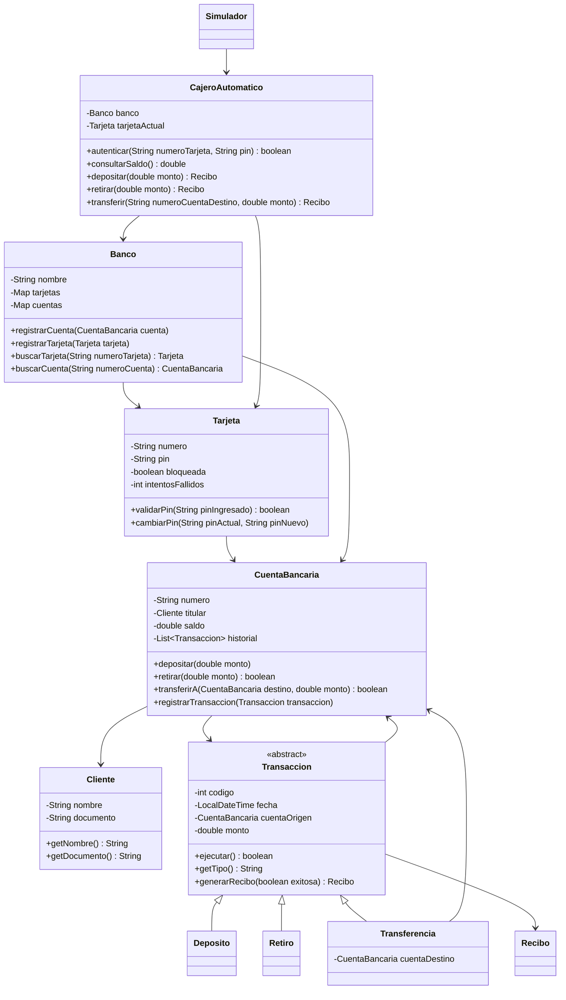
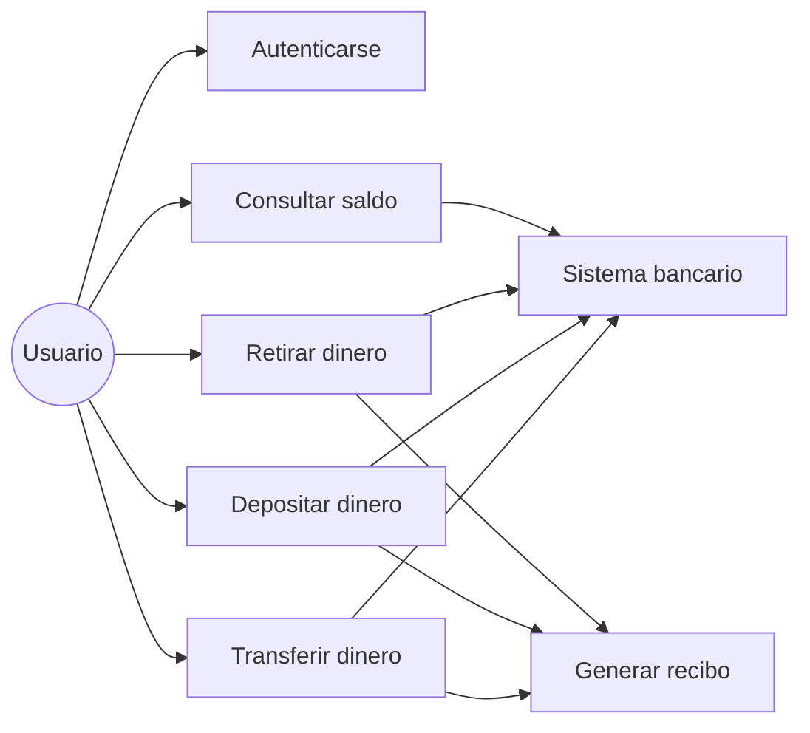
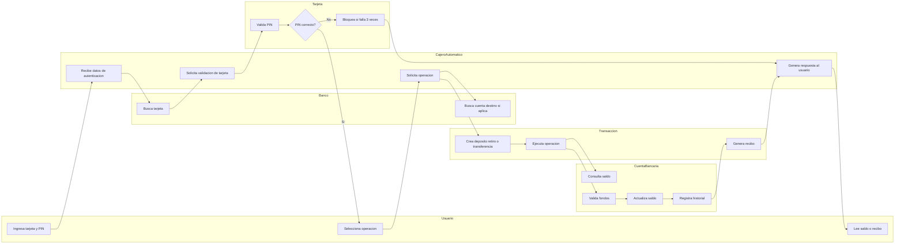
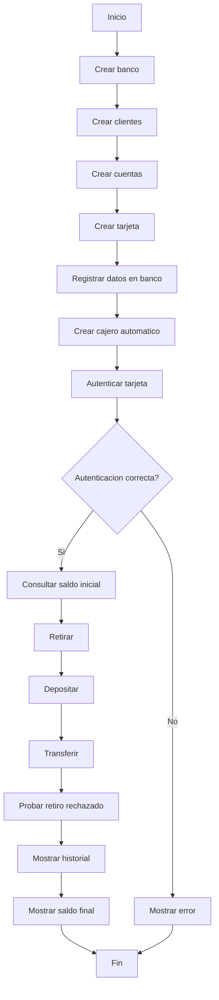
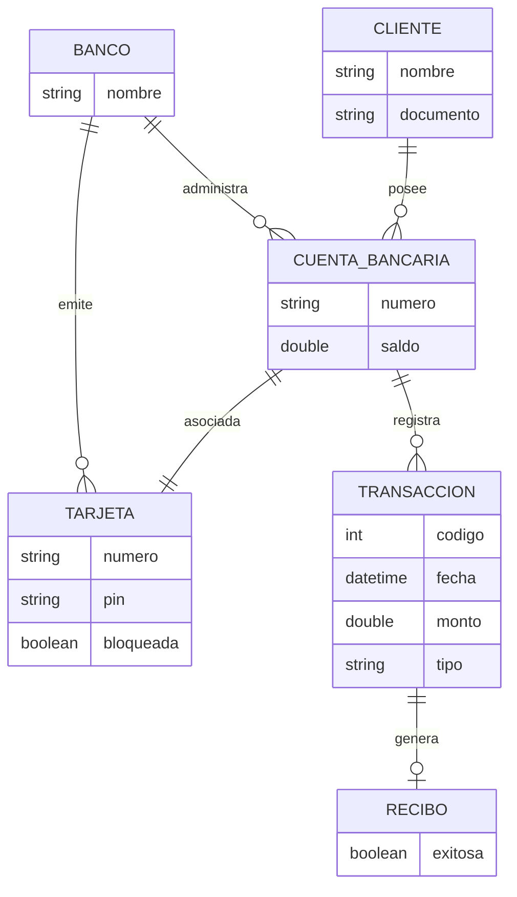

# Diagramas Del Proyecto Cajero Automatico

Estos diagramas documentan el analisis y diseno del proyecto. GitHub puede mostrar los diagramas Mermaid directamente desde este archivo.

## Diagrama De Clases

## Diagrama De Casos De Uso

## Diagrama De Actividades Con Carriles

Este es el diagrama de actividades con carriles de responsabilidad. Cada carril representa quien participa en una parte del proceso.

## Diagrama De Flujo Principal

## Modelo Entidad-Relacion Conceptual

El proyecto no usa base de datos, pero este modelo ayuda a entender las entidades principales si luego se quisiera persistir informacion.

